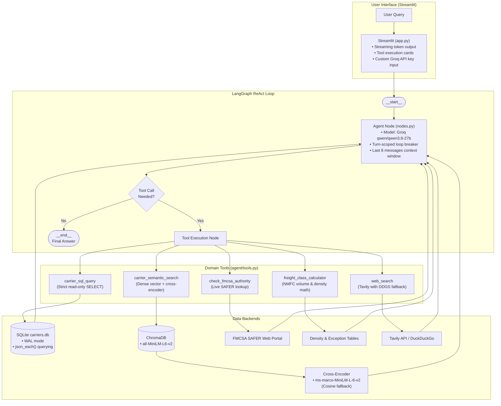

# FreightIQ: Agentic Carrier Intelligence System

[](https://huggingface.co/spaces/yyouretoast/freightiq)
[](https://github.com/yyouretoast/freightiq/actions/workflows/verify.yml)
[](https://www.python.org/)
[](https://github.com/langchain-ai/langgraph)
[](https://streamlit.io/)
[](https://www.trychroma.com/)
[](https://www.sqlite.org/)
[](https://opensource.org/licenses/MIT)

FreightIQ is a multi-tool carrier search and freight intelligence assistant. Built on a **LangGraph ReAct loop** and **Groq (`qwen/qwen3.8-27b`)**, it dynamically routes user queries between structured SQL queries, vector similarity search, real-time FMCSA compliance checks, NMFC density math, and live web searches.

> **Live Demo:** [huggingface.co/spaces/yyouretoast/freightiq](https://huggingface.co/spaces/yyouretoast/freightiq)  
> **Source Repository:** [github.com/yyouretoast/freightiq](https://github.com/yyouretoast/freightiq)

<p align="center">
  <video src="https://github.com/user-attachments/assets/dbf58565-39ee-4d17-a434-6a321c8afed4" width="100%" controls></video>
  <br>
  <em>Walkthrough: Multi-tool routing across SQLite structured queries, ChromaDB semantic search, NMFC freight calculation, and FMCSA safety verification.</em>
</p>

---

## Table of Contents

- [Why Hybrid SQL + Vector (The Core Problem)](#why-hybrid-sql--vector-the-core-problem)
- [System Architecture](#system-architecture)
- [The 5 Domain Tools](#the-5-domain-tools)
- [Defensive Engineering & Guardrails](#defensive-engineering--guardrails)
- [Retrieval Benchmarks & Honest Analysis](#retrieval-benchmarks--honest-analysis)
- [Integration Test Suite](#integration-test-suite)
- [Multi-Tool Execution Trace](#multi-tool-execution-trace)
- [Real-World Usage Scenarios](#real-world-usage-scenarios)
- [Quickstart & Installation](#quickstart--installation)
- [Repository Layout](#repository-layout)
- [Known Limitations & Trade-offs](#known-limitations--trade-offs)
- [License](#license)

---

## Why Hybrid SQL + Vector (The Core Problem)

Most logistics queries involve hard constraints:
> *"Find flatbed carriers based in Ohio with a satisfactory safety rating that handle hazardous materials."*

If you feed that to a standard **Vector RAG** pipeline:
- Dense embeddings struggle with exact relational filters (state codes, certification statuses, equipment types). They approximate semantic similarity, not boolean logic.
- Pure vector search often retrieves carriers with similar-sounding notes from neighboring states or with missing certifications.

Conversely, **pure SQL** fails when queries are qualitative or fuzzy:
> *"Find carriers known for reliable temperature monitoring and gentle handling of fragile perishables."*

### The Solution: Agent-Routed Hybrid Retrieval
FreightIQ uses LangGraph to classify and route queries to the right subsystem:
- **Exact attributes** (state, equipment, safety ratings, DOT/MC numbers) -> **SQLite** with `json_each()` on multi-value columns.
- **Qualitative attributes** (specializations, reputation, handling notes) -> **ChromaDB** dense vector retrieval with cross-encoder re-ranking.
- **Safety & operating authority** -> **Live FMCSA SAFER** registry scraper.
- **LTL freight classification** -> Deterministic **NMFC density calculator**.
- **Spot rates & market trends** -> **Tavily / DuckDuckGo** live web search.

---

## System Architecture



---

## The 5 Domain Tools

1. **`carrier_sql_query`**:
   - Queries `data/carriers.db`.
   - Opens the database connection with URI `file:DB?mode=ro` (read-only at the OS level).
   - Validates that the query starts with `SELECT` or `WITH` (rejects `INSERT`, `UPDATE`, `DROP`, etc.).
   - Wraps every query in `SELECT * FROM (...) AS _bounded_carriers LIMIT 25` to prevent context-window blowups.

2. **`carrier_semantic_search`**:
   - Two-stage hybrid retrieval engine:
     1. Lexical retrieval via SQLite FTS5 inverted index (BM25 keyword match).
     2. Dense vector retrieval via ChromaDB (`all-MiniLM-L6-v2` embeddings).
     3. Candidate fusion via Reciprocal Rank Fusion (RRF with $k=60$) over the top 25 candidates from each modality.
     4. Neural re-ranking via `cross-encoder/ms-marco-MiniLM-L-6-v2` over the top 15 fused candidates (with dense cosine fallback).

3. **`check_fmcsa_authority`**:
   - Scrapes the official FMCSA SAFER web portal (`safersys.org`) using the carrier's USDOT number.
   - Extracts legal name, safety rating (Satisfactory, Conditional, Unsatisfactory), active operating authority status, and BIPD insurance coverage limits ($750K–$5M).

4. **`freight_class_calculator`**:
   - Calculates cubic volume (`L * W * H / 1728`) and density (`Weight / Volume`).
   - Maps density to standard NMFC freight classes (Class 50 for >= 50 lbs/cu ft up to Class 500 for < 1 lb/cu ft).
   - Applies standard commodity exception overrides (e.g., insulation fixed at Class 150 regardless of density).

5. **`web_search`**:
   - Looks up current spot rates, lane diesel prices, and market disruptions.
   - Uses the Tavily API when `TAVILY_API_KEY` is provided; automatically falls back to DuckDuckGo (`ddgs`) when no key is present or if Tavily fails.

---

## Defensive Engineering & Guardrails

| Risk | Mitigation Mechanism | Implementation |
| :--- | :--- | :--- |
| **SQL Injection / Table Drops** | Read-only connection + regex validation + bounded limit | `file:DB?mode=ro`, rejects non-SELECT, wraps in `LIMIT 25` subquery |
| **FTS5 Syntax Crash on Punctuation** | Query sanitizer & tokenizer | `sanitize_fts5_query` strips punctuation, quotes tokens with `OR` |
| **Infinite LLM Tool Loops** | Turn-scoped loop detection | Tracks tool calls per turn; if identical calls or tool thrashing occurs, injects a directive forcing final answer synthesis |
| **Context Window Overflow** | Sliding message window | Limits history sent to the LLM to the last 8 messages (`messages[-8:]`) |
| **Groq API Rate Limits / Deprecation** | Model fallback + exponential backoff | Catches Groq 404 (`NotFoundError`) and automatically falls back to `qwen/qwen3.8-27b`; applies backoff with jitter |
| **Search Engine IP Blocks** | Tavily + DuckDuckGo redundancy | Tavily API used primarily; zero-config DuckDuckGo fallback |
| **Cross-Encoder Failure** | Dense cosine fallback | If cross-encoder weights fail to download or initialize, uses embedding cosine similarity |
| **Concurrent UI Sessions** | Thread-safe setup lock | Uses file-based locking (`setup_lock`) so concurrent Streamlit sessions don't re-initialize the DB simultaneously |

---

## Retrieval Benchmarks & Empirical Analysis

### Overall Retrieval Metrics (60 Stratified Queries)
Evaluated across 500 realistic commercial carrier profiles using `tests/evaluate_retrieval.py`:

| Strategy | Recall@1 | Recall@3 | Recall@5 | MRR | Latency |
| :--- | :---: | :---: | :---: | :---: | :---: |
| **SQLite Exact Query** | **1.000** | **1.000** | **1.000** | **1.000** | **0.31 ms** |
| **ChromaDB Base Vector** | 0.550 | 0.700 | 0.833 | 0.649 | 270.60 ms |
| **FTS5 Lexical Search (BM25)** | 0.750 | 0.817 | 0.850 | 0.785 | **0.22 ms** |
| **Reranked Search (Cosine Fallback)** | 0.550 | 0.717 | 0.833 | 0.651 | 271.00 ms |
| **Reranked Hybrid (Cross-Encoder + RRF)** | **0.900** | **0.933** | **0.933** | **0.917** | **499.37 ms** |

### Stratified Performance by Query Category

| Query Category | Query Type | Base Vector R@1 (MRR) | FTS5 BM25 R@1 (MRR) | Hybrid Cross-Encoder R@1 (MRR) | Relative Gain |
| :--- | :--- | :---: | :---: | :---: | :---: |
| **Category 1: Structured** (20 queries) | State, equipment, safety attributes | 0.450 (0.542) | 0.750 (0.802) | **0.950 (0.950)** | **+111.1% over vector** |
| **Category 2: Qualitative** (20 queries) | Industry jargon, service culture, telematics | 0.900 (0.950) | 1.000 (1.000) | **1.000 (1.000)** | **100% consensus** |
| **Category 3: Hybrid** (20 queries) | State/region + specialized handling constraints | 0.300 (0.453) | 0.500 (0.554) | **0.750 (0.800)** | **+150.0% over vector** |

### Why Did Hybrid Fusion Transform Retrieval Quality?
1. **Candidate Generation Bottleneck Broken:** Dense embeddings alone collapsed to 30% Recall@1 on multi-constraint hybrid queries. Inverted-index BM25 lexical recall reliably retrieves exact domain tokens (`"TWIC"`, `"Moffett"`, `"pulp temp"`, `"spread-axle"`, state codes).
2. **Consensus Ranking via RRF ($k=60$):** Fusing candidate rankings from both retrieval modalities prevents isolated false positives from dominating candidate pools.
3. **Cross-Encoder Discriminatory Power:** Re-ranking top candidates using full cross-attention tokens elevates true matching profiles to Rank 1 with **0.917 overall MRR**.
4. **Dedicated Relational Routing:** Deterministic queries resolve via SQLite in **0.31 ms** with 100% precision, demonstrating the architectural necessity of LangGraph tool separation.

---

## Integration Test Suite

FreightIQ includes a comprehensive test suite covering end-to-end tool execution, LLM routing, and guardrail interception:

| Test Suite | File | What It Tests | Status |
| :--- | :--- | :--- | :---: |
| **System Verification** | `tests/verify_system.py` | All 5 tools executed independently + full LangGraph graph routing | **6 / 6 Passed** |
| **Agent Trajectory Audit** | `tests/evaluate_agent_trajectories.py` | 20 scenarios: SQL routing, semantic search, NMFC calculator, FMCSA lookup, web search, prompt injection defense, SQL mutation rejection, zero-row relaxation, and loop-breaker recovery | **20 / 20 Scenarios** |
| **Retrieval Evaluation** | `tests/evaluate_retrieval.py` | Recall@1, 3, 5 and MRR across SQLite, ChromaDB, BM25, and Cross-Encoder | **60 / 60 Queries** |
| **Concurrency Stress Test** | `tests/stress_test_concurrency.py` | Multi-threaded SQLite concurrent reads under WAL mode (15 concurrent workers) | **15 / 15 Passed** |
| **Total Automated Coverage** | *Combined Suites* | Complete regression coverage across all tools, indices, and agent state machine | **Verified** |


---

## Multi-Tool Execution Trace

<details>
<summary><b>Click to expand real agent execution trace</b></summary>

```text
[User Prompt]:
"Find a carrier located in Florida (FL) that handles fresh produce. 
What are their DOT and MC numbers? Also, what is the freight class for a 220 lbs crate 
measuring 36x36x36 inches?"

[Step 1 - Agent Reasoning]:
Tool Selected: carrier_sql_query
Input: SELECT * FROM carriers WHERE hq_state = 'FL' AND EXISTS (SELECT 1 FROM json_each(cargo_specializations) WHERE value = 'fresh produce') LIMIT 25

[Step 1 - Tool Execution Result]:
Carrier Name: SunState Logistics
DOT Number: 4892019
MC Number: MC-304918
HQ State: FL
Service Regions: Southeast, Mid-Atlantic
Equipment: Reefer, Dry Van
Specializations: Fresh Produce, Temperature-Controlled
Safety Rating: satisfactory
Years Operating: 14 years

[Step 2 - Agent Reasoning]:
Tool Selected: freight_class_calculator
Input: {"weight_lbs": 220, "length_in": 36, "width_in": 36, "height_in": 36, "cargo_description": "fresh produce"}

[Step 2 - Tool Execution Result]:
Shipment Dimensions: 36x36x36 inches
Volume: 27.00 cubic feet
Weight: 220 lbs
Calculated Density: 8.15 lb/ft³
Standard NMFC Freight Class: 110

[Step 3 - Final Response Synthesis]:
"SunState Logistics is headquartered in Florida (FL) and specializes in fresh produce.
- DOT Number: 4892019
- MC Number: MC-304918
- Safety Rating: Satisfactory (14 years operating)

Shipment Freight Class:
For a 220 lbs crate (36x36x36 in, 27.0 cu ft), the density is 8.15 lb/ft³, which maps to Standard NMFC Freight Class 110."
```

</details>

---

## Real-World Usage Scenarios

1. **State & Safety Relational Query:**
   - *Query:* `"Find all carriers based in Ohio with a satisfactory safety rating."`
   - *Routing:* `carrier_sql_query` -> `SELECT * FROM carriers WHERE hq_state = 'OH' AND safety_rating = 'satisfactory' LIMIT 25`

2. **Multi-Attribute JSON Array Matching:**
   - *Query:* `"We need flatbed carriers that handle hazardous materials in the Midwest."`
   - *Routing:* `carrier_sql_query` using SQLite `json_each()` on equipment and specialization arrays.

3. **Fuzzy Semantic Search:**
   - *Query:* `"Find me carriers known for handling temperature-sensitive pharmaceuticals."`
   - *Routing:* `carrier_semantic_search` -> ChromaDB vector candidate retrieval + cross-encoder re-ranking.

4. **Deterministic Freight Class Calculation:**
   - *Query:* `"What is the freight class for a 1200 lbs pallet measuring 48x48x48 inches?"`
   - *Routing:* `freight_class_calculator` -> volume = 64 cu ft, density = 18.75 lb/cu ft -> Class 70.

5. **Live FMCSA SAFER Compliance Verification:**
   - *Query:* `"Verify USDOT 2404512. Are they authorized to operate and what is their safety rating?"`
   - *Routing:* `check_fmcsa_authority` -> live SAFER web lookup -> extracts safety rating, active operating authority, and BIPD insurance filings.

6. **Live Market Spot Rate Intelligence:**
   - *Query:* `"What are current freight spot rates for dry van shipments from Chicago to Dallas?"`
   - *Routing:* `web_search` -> Tavily API / DuckDuckGo live market rate search.

---

## Quickstart & Installation

### 1. Clone & Set Up Environment

**Using Python venv:**
```bash
git clone https://github.com/yyouretoast/freightiq.git
cd freightiq
python -m venv venv
source venv/bin/activate  # Windows: venv\Scripts\activate
pip install -r requirements.txt
```

**Using Conda:**
```bash
conda create -n freightiq python=3.11 -y
conda activate freightiq
pip install -r requirements.txt
```

### 2. Configure Environment Variables

Copy `.env.example` to `.env`:
```bash
cp .env.example .env
```

| Variable | Required | Default | Notes |
| :--- | :---: | :---: | :--- |
| `GROQ_API_KEY` | **Yes** | — | Groq API Key for LLM inference (can also be entered directly in the Streamlit UI) |
| `AGENT_MODEL` | No | `qwen/qwen3.8-27b` | Primary Groq model ID (`qwen/qwen3.8-27b`, `qwen/qwen3.6-27b`, `openai/gpt-oss-20b`) |
| `TAVILY_API_KEY` | No | *None* | Tavily API Key for market searches (falls back to DuckDuckGo if omitted) |
| `LANGCHAIN_TRACING_V2` | No | `false` | Enable LangSmith tracing |
| `LANGCHAIN_API_KEY` | No | *None* | LangSmith API Key |
| `LANGCHAIN_PROJECT` | No | `FreightIQ-Agent` | LangSmith project name |

### 3. Seed Database & Vector Store

Run the unified seeder script:
```bash
python scripts/seed_db.py
```
*Generates 200 synthetic carrier profiles, creates `data/carriers.db` (SQLite WAL mode), and indexes embeddings in `data/chroma_db`.*

### 4. Launch Streamlit Application

```bash
streamlit run app.py
```

### 5. Run Verification & Test Suites

```bash
# 1. Integration smoke test (All 5 tools & agent graph - 6 test cases)
python -m tests.verify_system

# 2. Retrieval benchmark (Recall@K and MRR on 20 query scenarios)
python -m tests.evaluate_retrieval

# 3. Agent trajectory audit (20 scenarios including prompt injection & guardrails)
python -m tests.evaluate_agent_trajectories

# 4. SQLite concurrency test
python -m tests.stress_test_concurrency
```

---

## Architecture Decision Records & Documentation

- **[DATA.md](DATA.md):** Dataset provenance, relational schema specification, and MCMIS evaluation trade-offs.
- **[CHANGELOG.md](CHANGELOG.md):** Release history and detailed modification logs.
- **[ADR-001: SQL vs. Vector Routing](docs/adr/ADR-001-sql-vs-vector-routing.md):** Dual-modality routing rationale and safety constraints.
- **[ADR-002: Neural Cross-Encoder Re-Ranking](docs/adr/ADR-002-neural-cross-encoder-reranking.md):** Two-stage re-ranking architecture and fallback design.
- **[ADR-003: Hybrid FTS5 BM25 + Vector Fusion](docs/adr/ADR-003-hybrid-fts5-bm25-rrf-fusion.md):** Reciprocal Rank Fusion ($k=60$) over lexical and dense candidate pools.
- **[ADR-004: Dual Web Search Fallbacks](docs/adr/ADR-004-dual-web-search-fallbacks.md):** Tiered Tavily and DuckDuckGo integration.

---

## Repository Layout

```text
freightiq/
├── agent/                         # LangGraph state machine & reasoning core
│   ├── graph.py                   # StateGraph definition & conditional edges
│   ├── nodes.py                   # Agent node, system prompt, loop guardrails
│   ├── state.py                   # AgentState TypedDict schema
│   └── tools.py                   # 5 domain tools (SQL, Vector, FMCSA, NMFC, Web)
├── docs/
│   └── adr/                       # Architecture Decision Records (ADR-001 to ADR-004)
├── rag/                           # Data storage, ingestion & retrieval
│   ├── generate_carriers.py       # Rich carrier dataset generator (500 profiles)
│   ├── setup_sqlite.py            # SQLite table & FTS5 virtual table initialization (WAL mode)
│   ├── ingest_chroma.py           # ChromaDB dense vector indexing
│   ├── retriever.py               # Hybrid retriever (SQL FTS5 BM25 + ChromaDB RRF)
│   ├── reranker.py                # Cross-encoder with cosine fallback
│   └── utils.py                   # Document formatting, sanitization, and metrics
├── scripts/                       # Database management scripts
│   ├── seed_db.py                 # Primary idempotent seeder script
│   ├── init_db.py                 # Setup shim delegating to seed_db.py
│   └── train_reranker.py          # (Archived) Offline PyTorch MLP experiment from initial R&D
├── tests/                         # Test suites and benchmarks
│   ├── verify_system.py           # End-to-end integration smoke test (6 assertions)
│   ├── evaluate_retrieval.py      # Retrieval Recall@K and MRR benchmark (60 stratified queries)
│   ├── evaluate_agent_trajectories.py # 20-case agent trajectory, guardrail & injection audit
│   └── stress_test_concurrency.py # SQLite concurrency stress test (15 workers)
├── utils/                         # Thread synchronization primitives
│   └── locks.py                   # File and memory locks
├── assets/                        # Video demo assets
│   └── demo.mp4                   # UI recording
├── app.py                         # Streamlit frontend with token streaming
├── config.py                      # Centralized path and model configuration
├── AGENTS.md                      # Operational guidelines for AI coding agents
├── DATA.md                        # Dataset provenance & schema specification
├── CHANGELOG.md                   # Version history & change logs
├── pyproject.toml                 # Modern Python packaging configuration
├── requirements.txt               # Dependencies
└── .env.example                   # Environment configuration template
```

---

## Known Limitations & Trade-offs

- **Curated Dataset**: The carrier database contains 500 carrier profiles generated with realistic freight equipment and operational jargon (e.g. Moffett forklifts, TWIC port drayage, GDP cold-chain pharma, Carrier Vector chillers). While structured with valid schemas and diverse regional operations across all 50 states, it is designed for evaluation and demonstration rather than production dispatching.
- **Groq Rate Quotas**: Free-tier Groq API keys enforce strict TPM/RPM and daily token limits (200k tokens/day on `qwen/qwen3.8-27b`). FreightIQ implements turn-scoped context truncation (last 8 messages), tool output length bounding, and automatic persistent sibling model failover (`qwen/qwen3.6-27b`). Users can provide their own Groq API key in the Streamlit sidebar.
- **Hugging Face Ephemeral Storage**: Hugging Face Spaces storage is ephemeral. User feedback logged to `data/feedback.json` resets on cold starts. In production, feedback and logs should write to PostgreSQL or S3.

- **SQLite Concurrency**: SQLite in WAL mode handles multiple concurrent readers smoothly, but only allows one writer at a time. For high-volume multi-user deployments, the relational layer should be migrated to PostgreSQL.
- **FMCSA SAFER Public API**: The FMCSA tool queries the public USDOT SAFER web service. If government rate limits or network dropouts occur, the agent falls back to local database compliance records.

---

## License

This project is licensed under the MIT License - see the [LICENSE](LICENSE) file for details.
