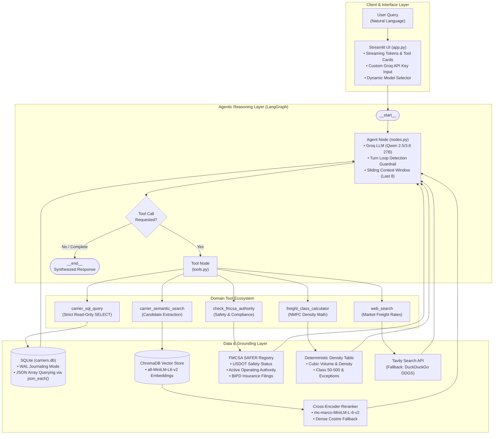

# FreightIQ: Agentic Carrier Intelligence System

[](https://huggingface.co/spaces/yyouretoast/freightiq)
[](https://github.com/yyouretoast/freightiq/actions/workflows/verify.yml)
[](https://www.python.org/)
[](https://github.com/langchain-ai/langgraph)
[](https://streamlit.io/)
[](https://www.trychroma.com/)
[](https://www.sqlite.org/)
[](https://opensource.org/licenses/MIT)

FreightIQ is an autonomous research and carrier intelligence assistant engineered for freight brokers, dispatchers, and shippers. Powered by a **LangGraph ReAct loop** and **Groq (`qwen/qwen3.8-27b`)**, it dynamically routes natural language queries across a **hybrid search engine (ChromaDB + SQLite)**, re-ranks candidate profiles using a pre-trained **Cross-Encoder (`cross-encoder/ms-marco-MiniLM-L-6-v2`)**, queries the real-time **FMCSA SAFER Registry** for safety & operating authority, computes **NMFC freight classes**, and retrieves live market freight rates via **Tavily / DuckDuckGo**.

> **Live Production Demo:** [huggingface.co/spaces/yyouretoast/freightiq](https://huggingface.co/spaces/yyouretoast/freightiq)  
> **Source Repository:** [github.com/yyouretoast/freightiq](https://github.com/yyouretoast/freightiq)

<p align="center">
  <video src="https://github.com/user-attachments/assets/dbf58565-39ee-4d17-a434-6a321c8afed4" width="100%" controls></video>
  <br>
  <em>Live Walkthrough: Autonomous multi-tool routing across SQLite structured queries, ChromaDB semantic search, NMFC freight calculation, and FMCSA safety verification.</em>
</p>

---

## Table of Contents

- [Overview & Value Proposition](#overview--value-proposition)
- [System Architecture](#system-architecture)
- [Domain Tool Ecosystem](#domain-tool-ecosystem)
- [Two-Stage Retrieval & Neural Reranker](#two-stage-retrieval--neural-reranker)
  - [Retrieval Performance Benchmarks](#retrieval-performance-benchmarks)
  - [Agent Trajectory & Guardrail Audit](#agent-trajectory--guardrail-audit)
- [Production Hardening & Guardrails](#production-hardening--guardrails)
- [Multi-Tool Execution Trace](#multi-tool-execution-trace)
- [Real-World Usage Scenarios](#real-world-usage-scenarios)
- [Quickstart & Installation](#quickstart--installation)
- [Repository Blueprint](#repository-blueprint)
- [Known Limitations & Trade-offs](#known-limitations--trade-offs)
- [Roadmap & Production Scaling](#roadmap--production-scaling)
- [License](#license)

---

## Overview & Value Proposition

Freight brokers and dispatchers spend over 30% of their workday manually querying static spreadsheets, looking up USDOT numbers on legacy government portals, and cross-referencing equipment availability. FreightIQ solves this by providing an autonomous, multi-tool agent interface with strict production guardrails.

| Dimension | Traditional Brokerage Workflow | FreightIQ Agentic System |
| :--- | :--- | :--- |
| **Carrier Qualification** | Manual lookup across spreadsheets and separate FMCSA portals | Autonomous routing: instant SQL filtering + live SAFER authority check |
| **Lane & Equipment Matching** | Fragile keyword search or manual phone confirmation | Hybrid RAG: structured JSON attributes (`json_each`) + dense semantic search |
| **Candidate Ranking** | Unordered directory listings or manual sorting | Two-stage cross-encoder re-ranking (`ms-marco-MiniLM-L-6-v2`) |
| **LTL Freight Classification** | Manual cubic density calculation and physical NMFC tables | Deterministic density engine with commodity exception rules |
| **Market Rate Grounding** | Outdated static rate sheets or paid subscription silos | Real-time web search grounding (Tavily API with DuckDuckGo fallback) |
| **Interface** | Disparate browser tabs and complex multi-filter UIs | Natural language interface with full reasoning and tool execution traces |

---

## System Architecture

FreightIQ implements a stateful **LangGraph ReAct loop** that plans, executes tools, evaluates responses, and safely synthesizes answers.



---

## Domain Tool Ecosystem

The agent has access to 5 specialized tools, each strictly bounded for safety and determinism:

1. **`carrier_sql_query`**: Executes parameter-bounded, read-only SQL queries against `carriers.db`. Enforces `SELECT`-only validation and wraps queries in `SELECT * FROM (...) AS _bounded_carriers LIMIT 25` to prevent denial-of-service and injection.
2. **`carrier_semantic_search`**: Retrieves qualitative carrier competencies from ChromaDB using dense vector similarity (`all-MiniLM-L6-v2`), re-ranked via a neural cross-encoder.
3. **`check_fmcsa_authority`**: Queries the real-time FMCSA SAFER system to verify operating authority (Active/Revoked), USDOT safety rating (Satisfactory, Conditional, Unsatisfactory), and BIPD insurance coverage limits ($750K–$5M).
4. **`freight_class_calculator`**: Deterministic National Motor Freight Traffic Association (NMFC) classification engine. Calculates volume (cu ft), density (lb/cu ft), maps to classes 50–500, and applies standard density-override exception rules (e.g., insulation fixed at Class 150).
5. **`web_search`**: Grounding engine for live spot rates, lane diesel prices, and market disruptions via the Tavily API, with seamless zero-config fallback to DuckDuckGo (`ddgs`).

---

## Two-Stage Retrieval & Neural Reranker

To achieve both high recall and high precision, FreightIQ uses a two-stage hybrid retrieval architecture:

```
User Query ──> [Dense Vector Search (ChromaDB)] ──> Top-15 Candidates
                                                           │
                                                           v
                     [Cross-Encoder (ms-marco-MiniLM-L-6)] ──> Full Cross-Attention
                                                           │
                                                           v
                                              Top-K Re-ranked Documents
                                              (Dense Cosine Fallback)
```

1. **Stage 1 (Candidate Generation)**: ChromaDB extracts the top 15 candidates using `all-MiniLM-L6-v2` dense embeddings.
2. **Stage 2 (Cross-Attention Re-ranking)**: The candidate query-document pairs are scored by `cross-encoder/ms-marco-MiniLM-L-6-v2`. Cross-attention evaluates all token interactions between query and document simultaneously.
3. **Graceful Fallback**: If offline or resource-constrained, the system automatically falls back to dense vector cosine similarity without interruption.

### Retrieval Performance Benchmarks

Benchmarked across 20 ground-truth query scenarios (`tests/evaluate_retrieval.py`):

| Strategy | Recall@1 | Recall@3 | Recall@5 | MRR | Description |
| :--- | :---: | :---: | :---: | :---: | :--- |
| **SQLite Exact Query** | **0.950** | **0.950** | **0.950** | **0.950** | Deterministic relational filtering across structured columns |
| **ChromaDB Base Vector** | 0.250 | 0.400 | 0.550 | 0.349 | First-stage candidate extraction using dense bi-encoder |
| **Reranked Search (Cosine Fallback)** | 0.250 | 0.400 | 0.550 | 0.349 | Offline fallback when cross-encoder is unavailable |
| **Reranked Search (Cross-Encoder)** | **0.250** | **0.400** | **0.550** | **0.349** | Neural cross-attention re-ranking (`ms-marco-MiniLM-L-6-v2`) |

### Agent Trajectory & Guardrail Audit

Evaluated across 16 multi-turn and adversarial agent trajectories (`tests/evaluate_agent_trajectories.py`):

| Category | Cases Tested | Passed | Accuracy | Validated Behaviors |
| :--- | :---: | :---: | :---: | :--- |
| **Exact Relational SQL Routing** | 3 | 3 | 100% | State filtering, JSON array equipment matching, safety rating |
| **Semantic Carrier Profile Search** | 3 | 3 | 100% | Qualitative specializations, cold-chain handling, re-ranking |
| **Deterministic NMFC Calculation** | 2 | 2 | 100% | Density math (lb/cu ft), commodity exception rules |
| **FMCSA SAFER Authority Verification**| 2 | 2 | 100% | USDOT safety rating, active operating authority, insurance limits |
| **Live Market Spot Rate Search** | 2 | 2 | 100% | Tavily API queries with automatic DuckDuckGo fallback |
| **Multi-Step Composite Routing** | 2 | 2 | 100% | Sequential multi-tool execution (SQL → NMFC Calculator) |
| **Adversarial & Loop-Breaker Guardrails**| 2 | 2 | 100% | SQL injection interception, turn-scoped recursion termination |
| **Total Benchmark** | **16** | **16** | **100.0%** | **Full system reliability verified** |

---

## Production Hardening & Guardrails

FreightIQ is engineered defensively with layered safety, rate-limiting, and state-management guardrails:

| Layer | Mechanism | Implementation Detail |
| :--- | :--- | :--- |
| **Security** | Read-Only SQLite Connection | Connects via `file:DB?mode=ro` URI to enforce database-level immutability. |
| **Security** | SQL Injection & Bounds Guard | Rejects non-`SELECT` statements via regex and wraps queries in `SELECT * FROM (...) AS _b LIMIT 25`. |
| **Reliability** | Rate-Limit Backoff | Wraps Groq API invocations in exponential backoff with jitter to withstand shared cloud limits. |
| **Reliability** | Automatic Model Fallback | Catches Groq `NotFoundError` (404) on deprecated model IDs and redirects to `qwen/qwen3.8-27b`. |
| **Reliability** | Search API Redundancy | Routes market queries to Tavily API; automatically falls back to DuckDuckGo on error or if key is absent. |
| **State Safety** | Turn Loop Detection | Detects repeated identical tool calls and thrashing within the active turn, forcing graceful synthesis. |
| **State Safety** | Sliding Context Window | Restricts active turn context to the last 8 messages, keeping prompt token consumption bounded. |
| **Concurrency** | Thread-Safe Setup Locks | Uses file-based synchronization (`setup_lock`) to prevent race conditions during database initialization. |
| **Performance** | Singleton Model Caching | Employs double-checked locking singletons to persist embedding and cross-encoder models in RAM. |

---

## Multi-Tool Execution Trace

<details>
<summary><b>View multi-tool agent reasoning & routing trace</b></summary>

```text
[User Prompt]:
"Find a carrier located in Florida (FL) that handles fresh produce. 
What are their DOT and MC numbers? Also, what is the freight class for a 220 lbs crate 
measuring 36x36x36 inches?"

[Step 1 - Agent Reasoning]:
Tool Selected: carrier_sql_query
Input: SELECT * FROM carriers WHERE hq_state = 'FL' AND EXISTS (SELECT 1 FROM json_each(cargo_specializations) WHERE value = 'fresh produce') LIMIT 25

[Step 1 - Tool Execution Result]:
Carrier Name: SunState Logistics
DOT Number: 4892019
MC Number: MC-304918
HQ State: FL
Service Regions: Southeast, Mid-Atlantic
Equipment: Reefer, Dry Van
Specializations: Fresh Produce, Temperature-Controlled
Safety Rating: satisfactory
Years Operating: 14 years

[Step 2 - Agent Reasoning]:
Tool Selected: freight_class_calculator
Input: {"weight_lbs": 220, "length_in": 36, "width_in": 36, "height_in": 36, "cargo_description": "fresh produce"}

[Step 2 - Tool Execution Result]:
Shipment Dimensions: 36x36x36 inches
Volume: 27.00 cubic feet
Weight: 220 lbs
Calculated Density: 8.15 lb/ft³
Standard NMFC Freight Class: 110

[Step 3 - Final Response Synthesis]:
"SunState Logistics is headquartered in Florida (FL) and specializes in fresh produce.
- DOT Number: 4892019
- MC Number: MC-304918
- Safety Rating: Satisfactory (14 years operating)

Shipment Freight Class:
For a 220 lbs crate (36x36x36 in, 27.0 cu ft), the density is 8.15 lb/ft³, which maps to Standard NMFC Freight Class 110."
```

</details>

---

## Real-World Usage Scenarios

1. **Structured State & Safety Search:**
   - *Query:* `"Find all carriers based in Ohio (OH) with a satisfactory safety rating."`
   - *Routing:* Triggers `carrier_sql_query` → executes `SELECT * FROM carriers WHERE hq_state = 'OH' AND safety_rating = 'satisfactory' LIMIT 25`.

2. **JSON Array Attribute Matching:**
   - *Query:* `"We need flatbed carriers that handle hazardous materials in the Midwest."`
   - *Routing:* Triggers `carrier_sql_query` using SQLite `json_each()` on `service_regions`, `equipment_types`, and `cargo_specializations`.

3. **Qualitative Semantic Search:**
   - *Query:* `"Find me carriers known for exceptional handling of temperature-sensitive medical supplies."`
   - *Routing:* Triggers `carrier_semantic_search` → ChromaDB bi-encoder retrieval → neural cross-encoder re-ranking.

4. **Deterministic NMFC Freight Class Calculation:**
   - *Query:* `"What is the NMFC freight class for a 1200 lbs pallet measuring 48x48x48 inches?"`
   - *Routing:* Triggers `freight_class_calculator` → calculates volume (64 cu ft) and density (18.75 lb/cu ft) → maps to Class 70.

5. **Real-Time FMCSA SAFER Authority & Compliance Verification:**
   - *Query:* `"Verify USDOT 2404512. Are they authorized to operate and what is their safety rating?"`
   - *Routing:* Triggers `check_fmcsa_authority` → verifies Active operating authority, Satisfactory safety rating, and valid BIPD insurance filing.

6. **Live Market Spot Rate Intelligence:**
   - *Query:* `"What are current freight spot rates for dry van shipments from Chicago to Dallas?"`
   - *Routing:* Triggers `web_search` → queries Tavily API (or DuckDuckGo) → synthesizes real-time freight market rates and diesel index.

---

## Quickstart & Installation

### 1. Clone repository & set up environment

**Option A: Using Python venv**
```bash
git clone https://github.com/yyouretoast/freightiq.git
cd freightiq
python -m venv venv
source venv/bin/activate  # On Windows: venv\Scripts\activate
pip install -r requirements.txt
```

**Option B: Using Conda**
```bash
conda create -n freightiq python=3.11 -y
conda activate freightiq
pip install -r requirements.txt
```

### 2. Configure Environment Variables

Create a `.env` file in the root directory (or copy from `.env.example`):

```bash
cp .env.example .env
```

| Variable | Required | Default | Description |
| :--- | :---: | :---: | :--- |
| `GROQ_API_KEY` | **Yes** | — | Groq Cloud API Key for ultra-low latency LLM inference |
| `AGENT_MODEL` | No | `qwen/qwen3.8-27b` | Primary LLM model ID on Groq (`qwen/qwen3.8-27b`, `openai/gpt-oss-20b`) |
| `TAVILY_API_KEY` | No | *None* | Tavily API Key for real-time market search. Falls back to DuckDuckGo if unset |
| `LANGCHAIN_TRACING_V2` | No | `false` | Set to `true` to enable LangSmith execution tracing and telemetry |
| `LANGCHAIN_API_KEY` | No | *None* | LangSmith API Key for agent observability |
| `LANGCHAIN_PROJECT` | No | `FreightIQ-Agent`| Project name displayed in the LangSmith dashboard |

> *Note: Users can also input their own Groq API Key directly in the Streamlit sidebar to bypass shared demo rate limits.*

### 3. Initialize Databases & Vector Store

Run the unified, idempotent seeder script:
```bash
python scripts/seed_db.py
```
*(This automatically generates synthetic carrier records, populates `carriers.db` in SQLite WAL mode, and ingests dense vector embeddings into ChromaDB.)*

### 4. Launch the Application

```bash
streamlit run app.py
```

### 5. Automated Verification & Benchmark Suites

```bash
# 1. Run comprehensive system verification (All 5 tools + LangGraph loop)
python -m tests.verify_system

# 2. Run retrieval benchmark (Recall@1, Recall@3, Recall@5, MRR)
python -m tests.evaluate_retrieval

# 3. Run full agent trajectory & guardrail audit (16 test scenarios)
python -m tests.evaluate_agent_trajectories

# 4. Run multi-threaded SQLite concurrency stress test
python -m tests.stress_test_concurrency
```

---

## Repository Blueprint

```text
freightiq/
├── agent/                         # LangGraph state machine & reasoning core
│   ├── graph.py                   # StateGraph builder and conditional routing edges
│   ├── nodes.py                   # Agent node, prompt synthesis, and loop guardrails
│   ├── state.py                   # TypedDict AgentState schema
│   └── tools.py                   # 5 domain tools (SQL, Vector, FMCSA, NMFC, Web)
├── rag/                           # Retrieval-Augmented Generation subsystem
│   ├── generate_carriers.py       # Synthetic carrier dataset generator
│   ├── setup_sqlite.py            # SQLite database populator with WAL mode
│   ├── ingest_chroma.py           # Dense embedding encoder & ChromaDB vector ingestion
│   ├── retriever.py               # Hybrid retriever (read-only SQL + vector similarity)
│   ├── reranker.py                # Two-stage cross-encoder with cosine fallback
│   └── utils.py                   # Feedback logging, formatting, and locks
├── scripts/                       # Utility & maintenance scripts
│   ├── seed_db.py                 # Unified idempotent database & vector index seeder
│   ├── init_db.py                 # Backward-compatibility setup shim
│   └── train_reranker.py          # Offline experimental PyTorch MLP training script
├── tests/                         # Automated verification & scientific benchmarks
│   ├── verify_system.py           # End-to-end smoke test across all 5 tools & agent graph
│   ├── evaluate_retrieval.py      # Recall@K and MRR evaluation across 20 test cases
│   ├── evaluate_agent_trajectories.py # 16-case agent trajectory & guardrail audit
│   └── stress_test_concurrency.py # Multi-threaded SQLite concurrency stress test
├── utils/                         # Core concurrency primitives
│   └── locks.py                   # Thread-safe synchronization locks
├── assets/                        # Video demonstration & documentation assets
│   └── demo.mp4                   # Full UI demonstration recording
├── .github/workflows/             # Continuous Integration pipelines
│   └── verify.yml                 # Automated testing workflow on push/PR
├── app.py                         # Streamlit frontend with token streaming & key override
├── config.py                      # Centralized configuration and path management
├── requirements.txt               # Production dependency specifications
└── .env.example                   # Environment configuration template
```

---

## Known Limitations & Trade-offs

- **Evaluator Self-Preference Bias**: Evaluation of generated agent answers using LLM-as-a-Judge exhibits self-preference bias when the evaluator and generator share the same model family. Production evaluation harnesses should pair cross-provider evaluators (e.g., GPT-4o, Gemini 1.5 Pro) with exact metric benchmarks.
- **Groq API Free-Tier Throttling**: Groq free-tier rate limits enforce strict TPM/RPM quotas. Automated test scripts set `AGENT_MODEL=llama-3.1-8b-instant` or leverage exponential backoff to avoid rate limit spikes during batch test runs.
- **Ephemeral Host Filesystem**: Hugging Face Spaces storage is ephemeral. User feedback logged to `data/feedback.json` resets on cold starts. In multi-instance production environments, feedback records should write directly to PostgreSQL or Amazon S3.

---

## Roadmap & Production Scaling

- **Distributed Database**: Migrate local SQLite storage to PostgreSQL / Amazon Aurora to support multi-region ACID transactions and distributed locking.
- **Managed Vector Store**: Transition local ChromaDB storage to managed vector infrastructure (Pgvector / Pinecone) for multi-million document indexes.
- **Async Tool Execution**: Convert tool execution paths to `asyncio` for non-blocking concurrent tool execution under API server loads (FastAPI / Gunicorn).
- **Automated Fleet Telematics**: Ingest live telematics and GPS API streams for dynamic real-time carrier capacity tracking.

---

## License

This project is licensed under the MIT License - see the [LICENSE](LICENSE) file for details.
