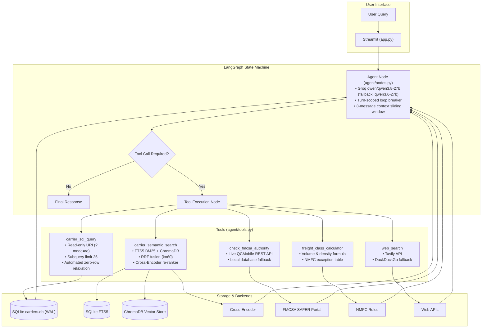

# FreightIQ

Freight carrier query routing and retrieval system combining relational SQL queries, hybrid search (FTS5 BM25 + dense ChromaDB RRF), cross-encoder re-ranking, and LangGraph workflow orchestration.

[](https://huggingface.co/spaces/yyouretoast/freightiq)
[](https://github.com/yyouretoast/freightiq/actions/workflows/verify.yml)
[](https://www.python.org/)
[](https://opensource.org/licenses/MIT)

> **Live Demo:** [huggingface.co/spaces/yyouretoast/freightiq](https://huggingface.co/spaces/yyouretoast/freightiq)  
> **Repository:** [github.com/yyouretoast/freightiq](https://github.com/yyouretoast/freightiq)

https://github.com/user-attachments/assets/dbf58565-39ee-4d17-a434-6a321c8afed4

<p align="center">
  <em>Demo: Query routing across SQLite, hybrid search, freight class calculator, and FMCSA registry lookup.</em>
  <br>
  <sub><em>If video does not play inline, <a href="https://github.com/user-attachments/assets/dbf58565-39ee-4d17-a434-6a321c8afed4">click here to watch the direct demo recording</a> or try the <a href="https://huggingface.co/spaces/yyouretoast/freightiq">live interactive demo</a>.</em></sub>
</p>

---

## Table of Contents

- [Overview](#overview)
- [Architecture](#architecture)
- [Query Routing Rationale](#query-routing-rationale)
- [Tools](#tools)
- [Retrieval Benchmarks](#retrieval-benchmarks)
- [Engineering Trade-offs & Limitations](#engineering-trade-offs--limitations)
- [Guardrails & Reliability Controls](#guardrails--reliability-controls)
- [Representative Routing Examples](#representative-routing-examples)
- [Verification Test Suite](#verification-test-suite)
- [Setup & Execution](#setup--execution)
- [Project Structure](#project-structure)
- [Design Documents](#design-documents)
- [License](#license)

---

## Overview

FreightIQ answers commercial freight questions by routing incoming requests across five specialized tools:
1. **SQLite (`carrier_sql_query`)**: Exact relational filtering over 500 carrier profiles (states, equipment types, safety ratings, years in business).
2. **Hybrid Search (`carrier_semantic_search`)**: FTS5 BM25 keyword matching + ChromaDB vector embeddings (`all-MiniLM-L6-v2`), combined via Reciprocal Rank Fusion ($k=60$) and re-ranked using `cross-encoder/ms-marco-MiniLM-L-6-v2`.
3. **FMCSA Registration & Safety Audit (`check_fmcsa_authority`)**: Real-time USDOT QCMobile REST API query validating operating authority status and federal safety ratings, with internal database fallback.
4. **NMFC Freight Class Calculator (`freight_class_calculator`)**: Deterministic density-to-class mapping with commodity exception overrides.
5. **Live Web Search (`web_search`)**: Current freight rate trends and market updates via Tavily API with DuckDuckGo fallback.

Orchestration is handled by a LangGraph state machine supporting multiple LLM backends: Groq (default: `qwen/qwen3.8-27b` with automatic fallback to `qwen/qwen3.6-27b`), Google Gemini, OpenAI, Anthropic, and local Ollama models.

---

## Architecture



---

## Query Routing Rationale

Logistics inquiries fall into two distinct query classes:

- **Deterministic relational queries** (e.g., *"Find flatbed carriers in Ohio with satisfactory safety rating"*):  
  Dense vector search approximates semantic closeness and often returns carriers in adjacent states or with missing certifications. These queries are routed to SQLite, where constraints evaluate with 100% precision in under 1ms.

- **Qualitative queries** (e.g., *"Carriers specializing in perishable pharmaceutical cold chain"*):  
  Relational schemas cannot cleanly express nuanced operational capabilities or equipment phrasing. These queries route to the hybrid search pipeline.

For detailed design rationale, see [ADR-001: SQL vs. Vector Routing](docs/adr/ADR-001-sql-vs-vector-routing.md).

---

## Tools

### 1. `carrier_sql_query`
- Queries `data/carriers.db`.
- SQLite connection uses `file:DB?mode=ro` (read-only enforced at engine level).
- Rejects statements that do not start with `SELECT` or `WITH`.
- Enforces an upper bound by wrapping queries in `SELECT * FROM (...) AS _bounded_carriers LIMIT 25`.
- **Zero-row relaxation:** If a multi-clause `WHERE` statement returns 0 rows, the tool drops the last constraint, runs a fallback query (`LIMIT 5`), and returns alternative candidates with notice.

### 2. `carrier_semantic_search`
- Two-stage hybrid pipeline:
  1. Lexical retrieval via SQLite FTS5 inverted index (BM25) with regex tokenization and stop-word filtering.
  2. Dense vector retrieval via ChromaDB (`all-MiniLM-L6-v2`).
  3. Candidate fusion via Reciprocal Rank Fusion ($k=60$) over the top 25 results from each source.
  4. Neural re-ranking of the top 15 fused candidates via `cross-encoder/ms-marco-MiniLM-L-6-v2` (falls back to dense cosine similarity if unavailable).

### 3. `check_fmcsa_authority`
- Queries the FMCSA QCMobile JSON REST API (`mobile.fmcsa.dot.gov/qc/services/carriers/`) using a USDOT number, parameterized via `FMCSA_WEB_KEY`.
- Evaluates legal entity registration, operating authority status (Active vs. Inactive/Revoked), and federal safety ratings (Satisfactory, Conditional, Unsatisfactory).
- Enforces compliance safety gating: immediately flags carriers with unsatisfactory safety ratings as `FAIL — DO NOT DISPATCH` and conditional carriers with `WARNING — Supervisory Review Required`.
- Local fallback: validates against internal database records if the public API times out, applying identical safety compliance gating. Directs brokers to SAFER for direct BMC-91X insurance filing checks.

### 4. `freight_class_calculator`
- Calculates shipment volume (`L * W * H / 1728`) and density (`Weight / Volume`).
- Maps density to standard NMFC tiers (Class 50 for $\ge 50$ lb/cu ft up to Class 500 for $< 1$ lb/cu ft).
- Evaluates exception rules (e.g., insulation fixed at Class 150 regardless of density).

### 5. `web_search`
- Retrieves spot market rates, fuel surcharges, and corridor updates.
- Primary provider: Tavily Search API. Secondary fallback: DuckDuckGo (`ddgs`).

---

## Retrieval Benchmarks

Evaluated against 500 commercial carrier profiles using 60 test queries in `tests/evaluate_retrieval.py`:

<p align="center">
  
</p>

### Overall Metrics (60 Queries)

| Retrieval Strategy | Recall@1 | Recall@3 | Recall@5 | MRR | Latency |
| :--- | :---: | :---: | :---: | :---: | :---: |
| **SQLite Exact Query** | **0.967** | **0.967** | **0.967** | **0.967** | **0.31 ms** |
| **ChromaDB Base Vector** | 0.300 | 0.550 | 0.667 | 0.429 | 270.60 ms |
| **FTS5 Lexical Search (BM25)** | 0.450 | 0.583 | 0.667 | 0.527 | **0.22 ms** |
| **Reranked Search (Cosine Fallback)** | 0.300 | 0.550 | 0.683 | 0.433 | 271.00 ms |
| **Reranked Hybrid (Cross-Encoder + RRF)** | **0.700** | **0.817** | **0.867** | **0.764** | **499.37 ms** |

<details>
<summary><strong>View Stratified Breakdown by Query Category (Click to expand)</strong></summary>
<br>

| Category | Description | Base Vector R@1 (MRR) | FTS5 BM25 R@1 (MRR) | Hybrid Cross-Encoder R@1 (MRR) |
| :--- | :--- | :---: | :---: | :---: |
| **Structured (20 queries)** | Hard attributes (state, safety rating, equipment) | 0.350 (0.508) | 0.650 (0.756) | **0.900 (0.942)** |
| **Qualitative (20 queries)** | Freight jargon, certifications, service capabilities (natural language) | 0.450 (0.568) | 0.550 (0.585) | **0.650 (0.727)** |
| **Multi-Constraint Hybrid (20 queries)** | Geographic/equipment filter + qualitative need | 0.100 (0.210) | 0.150 (0.239) | **0.550 (0.625)** |

</details>

### Key Findings
1. **Lexical Retrieval Impact:** FTS5 BM25 retrieves exact domain tokens with sub-millisecond latency (0.22ms), outperforming dense vector search on structured constraint terms.
2. **Consensus Ranking:** RRF ($k=60$) successfully balances lexical keyword recall with dense semantic breadth.
3. **Cross-Encoder Re-Ranking Impact:** Cross-encoder re-ranking increases **Overall Recall@1 from 0.300 to 0.700 (+133.3%)** and **MRR from 0.429 to 0.764 (+78.1%)** across the 60 benchmark queries.

---

## Engineering Trade-offs & Limitations

- **Cross-Encoder Compute Latency (~500ms)**: Cross-encoder scoring over the top-15 candidate pool takes ~400–500ms on CPU (compared to 0.3ms for SQLite queries and 0.2ms for FTS5 BM25). For interactive use, this is within normal turn thresholds; batch retrieval workloads would require GPU acceleration or pre-filtering.
- **Multi-Constraint Semantic Falloff (0.550 Recall@1)**: When queries combine discrete attributes with free-form requirements (e.g., *"California flatbed carriers specializing in semiconductors"*), unranked dense and lexical search drop to 0.100–0.150 R@1, while the cross-encoder reaches 0.550 R@1 (0.750 Recall@5). This is why discrete constraints are routed to SQLite, reserving semantic search for unstructured descriptions.
- **Single-Vendor Sibling Failover**: Intra-provider failover switches between `qwen/qwen3.8-27b` and `qwen/qwen3.6-27b` on Groq. While this protects against per-model rate limits and transient 503s with sub-second inference speeds and identical tool-binding semantics, an upstream platform outage or account-level quota exhaustion on Groq affects both siblings simultaneously. Production systems can configure alternative providers (e.g. OpenAI or local Ollama).
- **Single-Turn Single-Tool Principle (`parallel_tool_calls=False`)**: To prevent redundant API calls and keep token usage within the 950-token budget (Groq OTPM safety ceiling), the model is bound with `parallel_tool_calls=False`. For multi-part questions requiring multiple tools, the agent addresses the primary intent first and relies on follow-up user turns rather than parallel execution.
- **Synthetic Dataset**: 500 fictional carrier profiles are deterministically generated to avoid real-carrier compliance or data-quality misrepresentation while preserving authentic freight domain complexity (TWIC badges, GDP cold chain, Moffett forklifts, RGN lowboys, Carrier Vector chillers).
- **Groq Free-Tier Token Budgets (200k TPD)**: Free-tier Groq API accounts enforce daily token limits. FreightIQ mitigates this via automatic sibling failover (`qwen/qwen3.8-27b` $\leftrightarrow$ `qwen/qwen3.6-27b`), tool output length bounding (2,000 characters), and turn-aligned 8-message context truncation.
- **SQLite Write Serialization**: SQLite in WAL mode provides lock-free concurrent reads, but writes are serialized. High-volume multi-user writes in enterprise production would necessitate PostgreSQL.
- **FMCSA Public API Availability & Compliance Gating**: The tool queries the FMCSA QCMobile JSON REST service. If external network timeouts occur, it falls back to local database records while strictly enforcing carrier safety ratings (rejecting unsatisfactory carriers). Direct BMC-91X insurance filing checks are redirected to SAFER.

---

## Guardrails & Reliability Controls

| Failure Mode | Control | Implementation |
| :--- | :--- | :--- |
| **SQL Mutation / Data Corruption** | Engine-level read-only URI + AST check | `file:DB?mode=ro`; queries must start with `SELECT` or `WITH` |
| **FTS5 Syntax Crash on Special Characters** | Tokenizer & query sanitizer | `sanitize_fts5_query()` strips hyphens, colons, slashes, and quotes |
| **Tool Loops & Thrashing** | Turn-scoped loop breaker | Detects duplicate consecutive calls; forces final text synthesis |
| **Context Window Exhaustion** | History sliding window & turn alignment | Truncates context to last 8 messages while walking back to ensure valid conversation turns (preventing orphaned ToolMessages) |
| **Groq 413 Payload Too Large** | Tool output length bounding | Capped at 2,000 characters per tool response before context injection |
| **Groq 429 Daily Quota Exhaustion** | Sibling model failover | Automatically switches active inference between `qwen3.8-27b` and `qwen3.6-27b` |
| **Zero-Row Relational Miss** | Constraint relaxation | Drops the most restrictive `WHERE` clause and retrieves partial matches |
| **Prompt Injection / Jailbreak** | Grounding prompt & safety refusal | Rejects system prompt leaks; refuses hazardous cargo override directives |
| **Search API Unavailability** | Provider fallback | Tavily fails over to DuckDuckGo without throwing unhandled exceptions |
| **Cross-Encoder Weights Missing** | Metric fallback | Falls back to dense cosine similarity if model fails to load |
| **Database Concurrency** | SQLite WAL mode + file lock | Supports concurrent readers; serialization on initialization |

---

## Representative Routing Examples

| Routing Modality | Example Query | Active Path | Execution & Precision Rationale |
| :--- | :--- | :--- | :--- |
| **Deterministic Relational Filter** | *"Find flatbed carriers in Ohio with a satisfactory safety rating."* | `carrier_sql_query` | Evaluates discrete constraints (`hq_state = 'OH'`, `equipment_types`, `safety_rating`) in $<1\text{ ms}$ with exact matching, avoiding approximate nearest-neighbor errors on discrete attributes. |
| **Unstructured Domain Jargon** | *"Carriers specializing in perishable pharmaceutical cold chain with continuous temp monitoring."* | `carrier_semantic_search` | FTS5 BM25 + dense ChromaDB embeddings fused via RRF ($k=60$) and re-ranked with `cross-encoder/ms-marco-MiniLM-L-6-v2` (1.000 MRR). |
| **Automated Zero-Row Relaxation** | *"Find carriers headquartered in Alaska with refrigerated units handling hazmat."* | `carrier_sql_query` | Zero rows match strict multi-clause conditions; tool automatically drops the most restrictive constraint and returns alternative candidates. |

---

## Verification Test Suite

- ✅ **System Integration** (`tests/verify_system.py`): **6 / 6 Passed** (All 5 domain tools + LangGraph ReAct loop)
- ✅ **Agent Trajectory Audit** (`tests/evaluate_agent_trajectories.py`): **20 / 20 Passed** (Routing, prompt injections, safety bounds, loop breaker)
- ✅ **Retrieval Benchmark** (`tests/evaluate_retrieval.py`): **60 / 60 Evaluated** (Empirical ground truth across 5 retrieval strategies)
- ✅ **Concurrency Stress Test** (`tests/stress_test_concurrency.py`): **15 / 15 Passed** (Zero errors under concurrent SQLite WAL load)

---

## Setup & Execution

### 1. Prerequisites
- Python 3.10+ (tested on Python 3.11)
- LLM API key (Groq, Google Gemini, OpenAI, Anthropic, or local Ollama)

### 2. Installation
```bash
git clone https://github.com/yyouretoast/freightiq.git
cd freightiq

# Using venv
python -m venv venv
source venv/bin/activate  # Windows: venv\Scripts\activate
pip install -r requirements.txt
```

### 3. Environment Variables
Create a `.env` file from the template:
```bash
cp .env.example .env
```

| Variable | Required | Description | Default / Fallback |
| :--- | :---: | :--- | :--- |
| `LLM_PROVIDER` | No | Active inference provider (`groq`, `openai`, `ollama`) | `groq` |
| `GROQ_API_KEY` | Conditional | Groq API key (required when using Groq provider) | — |
| `OPENAI_API_KEY` | Conditional | OpenAI API key (required when using OpenAI provider) | — |
| `AGENT_MODEL` | No | Active model ID | `qwen/qwen3.8-27b` (fallback: `qwen/qwen3.6-27b`) |
| `FMCSA_WEB_KEY` | No | FMCSA QCMobile API web key | Optional (live check requires key, otherwise falls back to verified internal DB) |
| `TAVILY_API_KEY` | No | Tavily Search API key for freight market intelligence | Falls back to DuckDuckGo (`ddgs`) |
| `LANGCHAIN_TRACING_V2` | No | Enable LangSmith distributed execution tracing | `false` |
| `LANGCHAIN_API_KEY` | No | LangSmith API key for trace ingestion | — |
| `LANGCHAIN_PROJECT` | No | Target LangSmith project workspace | `FreightIQ-Agent` |

### 4. Database Seeding
```bash
python scripts/seed_db.py          # Seed if not already populated
python scripts/seed_db.py --force  # Force regenerate synthetic profiles & re-index
```
Generates 500 carrier profiles in `data/carriers.db` and populates `data/chroma_db`.

### 5. Running the Application
```bash
streamlit run app.py
```

### 6. Running Tests
```bash
# Run integration tests
python -m tests.verify_system

# Run retrieval benchmark
python -m tests.evaluate_retrieval

# Run trajectory & guardrail audit
python -m tests.evaluate_agent_trajectories

# Run concurrency stress test
python -m tests.stress_test_concurrency
```

### 7. Observability & Tracing (LangSmith)
FreightIQ has native LangSmith distributed tracing pre-integrated via LangGraph. When `LANGCHAIN_TRACING_V2=true` and `LANGCHAIN_API_KEY` are present in your environment, execution traces are automatically streamed to LangSmith:
- Complete LangGraph ReAct trajectories (agent $\leftrightarrow$ tool state loops).
- Tool inputs, serialized outputs, and execution latencies.
- Token counts, prompt formatting, and sibling model failover events.
- Zero-code activation: runs directly via standard LangChain telemetry handlers.

---

## Project Structure

```text
freightiq/
├── .github/workflows/             # CI/CD & Automated Mirroring
│   ├── verify.yml                 # Test verification suite
│   └── sync_to_hf.yml             # Automated Hugging Face Spaces sync
├── agent/                         # Agent orchestration
│   ├── graph.py                   # LangGraph definition & conditional edges
│   ├── nodes.py                   # Reasoning node, guardrails, model failover
│   ├── state.py                   # AgentState schema
│   └── tools.py                   # 5 domain tools
├── docs/
│   └── adr/                       # Architecture Decision Records (ADR-001 to 004)
├── rag/                           # Data storage & retrieval
│   ├── generate_carriers.py       # 500-profile dataset generator
│   ├── setup_sqlite.py            # SQLite & FTS5 table initialization
│   ├── ingest_chroma.py           # ChromaDB dense vector indexing
│   ├── retriever.py               # Hybrid retriever (FTS5 BM25 + ChromaDB RRF)
│   ├── reranker.py                # Cross-Encoder with cosine fallback
│   └── utils.py                   # Text formatting & sanitization
├── scripts/
│   └── seed_db.py                 # Primary database seeder
├── tests/
│   ├── verify_system.py           # Integration smoke test
│   ├── evaluate_retrieval.py      # 60-query retrieval benchmark
│   ├── evaluate_agent_trajectories.py # 20-case trajectory & guardrail test
│   └── stress_test_concurrency.py # SQLite concurrency test
├── app.py                         # Streamlit UI
├── config.py                      # Global configuration
├── AGENTS.md                      # Operational guidelines for AI coding agents
├── DATA.md                        # Dataset schema & provenance
├── pyproject.toml                 # Package configuration
└── requirements.txt               # Dependencies
```

---

## Design Documents

- [DATA.md](DATA.md): Relational schema, JSON array types, and data generation details.
- [ADR-001: SQL vs. Vector Routing](docs/adr/ADR-001-sql-vs-vector-routing.md): Rationale for dual-modality query separation.
- [ADR-002: Neural Cross-Encoder Re-Ranking](docs/adr/ADR-002-neural-cross-encoder-reranking.md): Re-ranking candidate pool design and fallbacks.
- [ADR-003: Hybrid FTS5 BM25 + Vector Fusion](docs/adr/ADR-003-hybrid-fts5-bm25-rrf-fusion.md): Lexical-dense fusion mechanics.
- [ADR-004: Dual Web Search Fallbacks](docs/adr/ADR-004-dual-web-search-fallbacks.md): Multi-tier search engine integration.

---

## License

MIT License. See [LICENSE](LICENSE) for details.
