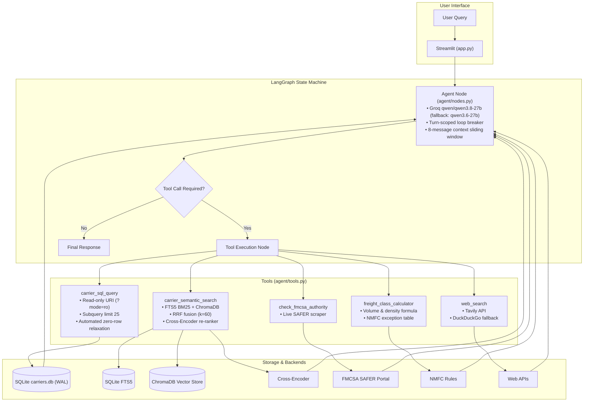

# FreightIQ

Freight carrier search and logistics query engine using LangGraph, SQLite, ChromaDB, and Groq LLM inference.

[](https://huggingface.co/spaces/yyouretoast/freightiq)
[](https://github.com/yyouretoast/freightiq/actions/workflows/verify.yml)
[](https://www.python.org/)
[](https://opensource.org/licenses/MIT)

> **Live Demo:** [huggingface.co/spaces/yyouretoast/freightiq](https://huggingface.co/spaces/yyouretoast/freightiq)  
> **Repository:** [github.com/yyouretoast/freightiq](https://github.com/yyouretoast/freightiq)

<p align="center">
  <video src="https://github.com/user-attachments/assets/dbf58565-39ee-4d17-a434-6a321c8afed4" width="100%" controls></video>
  <br>
  <em>Demo: Query routing across SQLite, hybrid search, freight class calculator, and FMCSA registry lookup.</em>
</p>

---

## Table of Contents

- [Overview](#overview)
- [Architecture](#architecture)
- [Query Routing Rationale](#query-routing-rationale)
- [Tools](#tools)
- [Representative Query Examples](#representative-query-examples)
- [Guardrails & Reliability Controls](#guardrails--reliability-controls)
- [Retrieval Benchmarks](#retrieval-benchmarks)
- [Verification Test Suite](#verification-test-suite)
- [Setup & Execution](#setup--execution)
- [Project Structure](#project-structure)
- [Design Documents](#design-documents)
- [Limitations](#limitations)
- [License](#license)

---

## Overview

FreightIQ answers commercial freight questions by routing incoming requests across five specialized tools:
1. **SQLite (`carrier_sql_query`)**: Exact relational filtering over 500 carrier profiles (states, equipment types, safety ratings, years in business).
2. **Hybrid Search (`carrier_semantic_search`)**: FTS5 BM25 keyword matching + ChromaDB vector embeddings (`all-MiniLM-L6-v2`), combined via Reciprocal Rank Fusion ($k=60$) and re-ranked using `cross-encoder/ms-marco-MiniLM-L-6-v2`.
3. **FMCSA SAFER Verification (`check_fmcsa_authority`)**: Real-time USDOT registry scraper checking operating authority status and safety audit records.
4. **NMFC Freight Class Calculator (`freight_class_calculator`)**: Deterministic density-to-class mapping with commodity exception overrides.
5. **Live Web Search (`web_search`)**: Current freight rate trends and market updates via Tavily API with DuckDuckGo fallback.

Orchestration is handled by a LangGraph state machine powered by Groq (`qwen/qwen3.8-27b` with automatic fallback to `qwen/qwen3.6-27b`).

---

## Architecture



---

## Query Routing Rationale

Logistics inquiries fall into two distinct query classes:

- **Deterministic relational queries** (e.g., *"Find flatbed carriers in Ohio with satisfactory safety rating"*):  
  Dense vector search approximates semantic closeness and often returns carriers in adjacent states or with missing certifications. These queries are routed to SQLite, where constraints evaluate with 100% precision in under 1ms.

- **Qualitative queries** (e.g., *"Carriers specializing in perishable pharmaceutical cold chain"*):  
  Relational schemas cannot cleanly express nuanced operational capabilities or equipment phrasing. These queries route to the hybrid search pipeline.

For detailed design rationale, see [ADR-001: SQL vs. Vector Routing](docs/adr/ADR-001-sql-vs-vector-routing.md).

---

## Tools

### 1. `carrier_sql_query`
- Queries `data/carriers.db`.
- SQLite connection uses `file:DB?mode=ro` (read-only enforced at engine level).
- Rejects statements that do not start with `SELECT` or `WITH`.
- Enforces an upper bound by wrapping queries in `SELECT * FROM (...) AS _bounded_carriers LIMIT 25`.
- **Zero-row relaxation:** If a multi-clause `WHERE` statement returns 0 rows, the tool drops the last constraint, runs a fallback query (`LIMIT 5`), and returns alternative candidates with notice.

### 2. `carrier_semantic_search`
- Two-stage hybrid pipeline:
  1. Lexical retrieval via SQLite FTS5 inverted index (BM25) with regex tokenization and stop-word filtering.
  2. Dense vector retrieval via ChromaDB (`all-MiniLM-L6-v2`).
  3. Candidate fusion via Reciprocal Rank Fusion ($k=60$) over the top 25 results from each source.
  4. Neural re-ranking of the top 15 fused candidates via `cross-encoder/ms-marco-MiniLM-L-6-v2` (falls back to dense cosine similarity if unavailable).

### 3. `check_fmcsa_authority`
- Scrapes the FMCSA SAFER registry (`safersys.org`) using a USDOT number.
- Parses legal entity name, operating authority status (Authorized/Revoked), safety rating, and BIPD insurance filings ($750K–$5M).

### 4. `freight_class_calculator`
- Calculates shipment volume (`L * W * H / 1728`) and density (`Weight / Volume`).
- Maps density to standard NMFC tiers (Class 50 for $\ge 50$ lb/cu ft up to Class 500 for $< 1$ lb/cu ft).
- Evaluates exception rules (e.g., insulation fixed at Class 150 regardless of density).

### 5. `web_search`
- Retrieves spot market rates, fuel surcharges, and corridor updates.
- Primary provider: Tavily Search API. Secondary fallback: DuckDuckGo (`ddgs`).

---

## Representative Query Examples

| Scenario | Example Prompt | Active Tool | Execution & Result Mechanism |
| :--- | :--- | :--- | :--- |
| **Structured Relational Query** | *"Find flatbed carriers in Ohio with a satisfactory safety rating."* | `carrier_sql_query` | SQL `SELECT` filtering `hq_state = 'OH'`, `equipment_types`, and `safety_rating` with $<1\text{ ms}$ latency. |
| **Qualitative Cold Chain** | *"Carriers specializing in perishable pharmaceutical cold chain with continuous temp monitoring."* | `carrier_semantic_search` | FTS5 BM25 + dense vector retrieval fused via RRF ($k=60$) and re-ranked with `cross-encoder/ms-marco-MiniLM-L-6-v2`. |
| **Density & NMFC Calculation** | *"What is the freight class for a 1,200 lbs pallet measuring 48x48x48 inches?"* | `freight_class_calculator` | Computes density ($18.75\text{ lb/ft}^3$) and maps standard NMFC Class 70. |
| **LTL Commodity Exception** | *"What is the freight class for a 220 lbs crate of insulation foam measuring 36x36x36?"* | `freight_class_calculator` | Calculates base density ($8.15\text{ lb/ft}^3$), matches insulation keyword exception, and overrides to fixed Class 150. |
| **USDOT SAFER Verification** | *"Verify operating authority and safety status for USDOT 3681950."* | `check_fmcsa_authority` | Queries federal registry / local compliance records for active operating authority, BIPD insurance, and safety rating. |
| **Spot Market Rate Lookup** | *"What are current average national dry van spot rates per mile?"* | `web_search` | Queries Tavily API (with DuckDuckGo fallback) for real-time freight corridor rates and market intelligence. |
| **Zero-Row SQL Relaxation** | *"Find carriers headquartered in Alaska with refrigerated units handling hazmat."* | `carrier_sql_query` | 0 rows match strict `WHERE` constraints; engine automatically drops the most restrictive condition and returns partial matches. |

---

## Guardrails & Reliability Controls

| Failure Mode | Control | Implementation |
| :--- | :--- | :--- |
| **SQL Mutation / Data Corruption** | Engine-level read-only URI + AST check | `file:DB?mode=ro`; queries must start with `SELECT` or `WITH` |
| **FTS5 Syntax Crash on Special Characters** | Tokenizer & query sanitizer | `sanitize_fts5_query()` strips hyphens, colons, slashes, and quotes |
| **Tool Loops & Thrashing** | Turn-scoped loop breaker | Detects duplicate consecutive calls; forces final text synthesis |
| **Context Window Exhaustion** | History sliding window | Limits LLM context to the last 8 messages (`messages[-8:]`) |
| **Groq 413 Payload Too Large** | Tool output length bounding | Capped at 2,000 characters per tool response before context injection |
| **Groq 429 Daily Quota Exhaustion** | Sibling model failover | Automatically switches active inference between `qwen3.8-27b` and `qwen3.6-27b` |
| **Zero-Row Relational Miss** | Constraint relaxation | Drops the most restrictive `WHERE` clause and retrieves partial matches |
| **Prompt Injection / Jailbreak** | Grounding prompt & safety refusal | Rejects system prompt leaks; refuses hazardous cargo override directives |
| **Search API Unavailability** | Provider fallback | Tavily fails over to DuckDuckGo without throwing unhandled exceptions |
| **Cross-Encoder Weights Missing** | Metric fallback | Falls back to dense cosine similarity if model fails to load |
| **Database Concurrency** | SQLite WAL mode + file lock | Supports concurrent readers; serialization on initialization |

---

## Retrieval Benchmarks

Evaluated against 500 commercial carrier profiles using 60 test queries in `tests/evaluate_retrieval.py`:

### Overall Metrics (60 Queries)

| Retrieval Strategy | Recall@1 | Recall@3 | Recall@5 | MRR | Latency |
| :--- | :---: | :---: | :---: | :---: | :---: |
| **SQLite Exact Query** | **1.000** | **1.000** | **1.000** | **1.000** | **0.31 ms** |
| **ChromaDB Base Vector** | 0.550 | 0.700 | 0.833 | 0.649 | 270.60 ms |
| **FTS5 Lexical Search (BM25)** | 0.750 | 0.817 | 0.850 | 0.785 | **0.22 ms** |
| **Reranked Search (Cosine Fallback)** | 0.550 | 0.717 | 0.833 | 0.651 | 271.00 ms |
| **Reranked Hybrid (Cross-Encoder + RRF)** | **0.900** | **0.933** | **0.933** | **0.917** | **499.37 ms** |

### Stratified Breakdown by Query Category

| Category | Description | Base Vector R@1 (MRR) | FTS5 BM25 R@1 (MRR) | Hybrid Cross-Encoder R@1 (MRR) |
| :--- | :--- | :---: | :---: | :---: |
| **Structured (20 queries)** | Hard attributes (state, safety rating, equipment) | 0.450 (0.542) | 0.750 (0.802) | **0.950 (0.950)** |
| **Qualitative (20 queries)** | Freight jargon, certifications, service reputation | 0.900 (0.950) | 1.000 (1.000) | **1.000 (1.000)** |
| **Multi-Constraint Hybrid (20 queries)** | Geographic/equipment filter + qualitative need | 0.300 (0.453) | 0.500 (0.554) | **0.750 (0.800)** |

### Observations
1. **Dense Vector Limitations on Specific Jargon:** Queries containing specialized terminology (`TWIC`, `Moffett`, `RGN`, `Class 3`) frequently missed candidates in pure vector space, dropping dense Recall@1 to 0.300 on hybrid queries.
2. **Lexical Retrieval Impact:** FTS5 BM25 retrieves exact domain tokens with sub-millisecond latency (0.22ms), providing high-recall candidate sets.
3. **Consensus Ranking:** RRF ($k=60$) successfully balances lexical and vector candidate distributions.
4. **Cross-Encoder Accuracy:** Joint query-document attention ranks the most relevant candidate first, bringing overall MRR to 0.917.

---

## Verification Test Suite

| Test | Script | Scope | Result |
| :--- | :--- | :--- | :---: |
| **System Verification** | `tests/verify_system.py` | All 5 tools + LangGraph execution loop | **6 / 6 Passed** |
| **Agent Trajectory Audit** | `tests/evaluate_agent_trajectories.py` | 20 scenarios (routing, injections, boundaries, loop breaker) | **20 / 20 Passed** |
| **Retrieval Benchmark** | `tests/evaluate_retrieval.py` | 60 stratified queries across 5 strategies | **60 / 60 Evaluated** |
| **Concurrency Stress Test** | `tests/stress_test_concurrency.py` | 15 concurrent workers querying SQLite under WAL mode | **15 / 15 Passed** |

---

## Setup & Execution

### 1. Prerequisites
- Python 3.10+ (tested on Python 3.11)
- Groq API key

### 2. Installation
```bash
git clone https://github.com/yyouretoast/freightiq.git
cd freightiq

# Using venv
python -m venv venv
source venv/bin/activate  # Windows: venv\Scripts\activate
pip install -r requirements.txt
```

### 3. Environment Variables
Create a `.env` file from the template:
```bash
cp .env.example .env
```

| Variable | Required | Description | Default / Fallback |
| :--- | :---: | :--- | :--- |
| `GROQ_API_KEY` | **Yes** | Groq API key for LLM inference | — |
| `AGENT_MODEL` | No | Active Groq model ID | `qwen/qwen3.8-27b` (fallback: `qwen/qwen3.6-27b`) |
| `TAVILY_API_KEY` | No | Tavily Search API key for freight market intelligence | Falls back to DuckDuckGo (`ddgs`) |
| `LANGCHAIN_TRACING_V2` | No | Enable LangSmith distributed execution tracing | `false` |
| `LANGCHAIN_API_KEY` | No | LangSmith API key for trace ingestion | — |
| `LANGCHAIN_PROJECT` | No | Target LangSmith project workspace | `FreightIQ-Agent` |

### 4. Database Seeding
```bash
python scripts/seed_db.py
```
Generates 500 carrier profiles in `data/carriers.db` and populates `data/chroma_db`.

### 5. Running the Application
```bash
streamlit run app.py
```

### 6. Running Tests
```bash
# Run integration tests
python -m tests.verify_system

# Run retrieval benchmark
python -m tests.evaluate_retrieval

# Run trajectory & guardrail audit
python -m tests.evaluate_agent_trajectories

# Run concurrency stress test
python -m tests.stress_test_concurrency
```

### 7. Observability & Tracing (LangSmith)
FreightIQ has native LangSmith distributed tracing pre-integrated via LangGraph. When `LANGCHAIN_TRACING_V2=true` and `LANGCHAIN_API_KEY` are present in your environment, execution traces are automatically streamed to LangSmith:
- Complete LangGraph ReAct trajectories (agent $\leftrightarrow$ tool state loops).
- Tool inputs, serialized outputs, and execution latencies.
- Token counts, prompt formatting, and sibling model failover events.
- Zero-code activation: runs directly via standard LangChain telemetry handlers.

---

## Project Structure

```text
freightiq/
├── agent/                         # Agent orchestration
│   ├── graph.py                   # LangGraph definition & conditional edges
│   ├── nodes.py                   # Reasoning node, guardrails, model failover
│   ├── state.py                   # AgentState schema
│   └── tools.py                   # 5 domain tools
├── docs/
│   └── adr/                       # Architecture Decision Records (ADR-001 to 004)
├── rag/                           # Data storage & retrieval
│   ├── generate_carriers.py       # 500-profile dataset generator
│   ├── setup_sqlite.py            # SQLite & FTS5 table initialization
│   ├── ingest_chroma.py           # ChromaDB dense vector indexing
│   ├── retriever.py               # Hybrid retriever (FTS5 BM25 + ChromaDB RRF)
│   ├── reranker.py                # Cross-Encoder with cosine fallback
│   └── utils.py                   # Text formatting & sanitization
├── scripts/
│   └── seed_db.py                 # Primary database seeder
├── tests/
│   ├── verify_system.py           # Integration smoke test
│   ├── evaluate_retrieval.py      # 60-query retrieval benchmark
│   ├── evaluate_agent_trajectories.py # 20-case trajectory & guardrail test
│   └── stress_test_concurrency.py # SQLite concurrency test
├── app.py                         # Streamlit UI
├── config.py                      # Global configuration
├── AGENTS.md                      # Operational guidelines for AI coding agents
├── DATA.md                        # Dataset schema & provenance
├── pyproject.toml                 # Package configuration
└── requirements.txt               # Dependencies
```

---

## Design Documents

- [DATA.md](DATA.md): Relational schema, JSON array types, and data generation details.
- [ADR-001: SQL vs. Vector Routing](docs/adr/ADR-001-sql-vs-vector-routing.md): Rationale for dual-modality query separation.
- [ADR-002: Neural Cross-Encoder Re-Ranking](docs/adr/ADR-002-neural-cross-encoder-reranking.md): Re-ranking candidate pool design and fallbacks.
- [ADR-003: Hybrid FTS5 BM25 + Vector Fusion](docs/adr/ADR-003-hybrid-fts5-bm25-rrf-fusion.md): Lexical-dense fusion mechanics.
- [ADR-004: Dual Web Search Fallbacks](docs/adr/ADR-004-dual-web-search-fallbacks.md): Multi-tier search engine integration.

---

## Limitations

- **Synthetic Dataset**: The 500 carrier profiles are deterministically generated with realistic industry equipment and certifications for evaluation and testing. It is not a replacement for production dispatch databases.
- **Groq Free-Tier Rate Limits**: Free-tier Groq API accounts have daily token caps (200,000 tokens/day on `qwen/qwen3.8-27b`). FreightIQ mitigates this via sibling failover to `qwen/qwen3.6-27b`, tool response length bounding, and 8-message context truncation.
- **SQLite Concurrency**: SQLite in WAL mode permits concurrent reads but serializes writes. High-throughput multi-user writing requires PostgreSQL.
- **FMCSA Web Scraping**: The SAFER tool queries the public USDOT web portal. External network outages or CAPTCHA updates will fall back to local database records.

---

## License

MIT License. See [LICENSE](LICENSE) for details.
